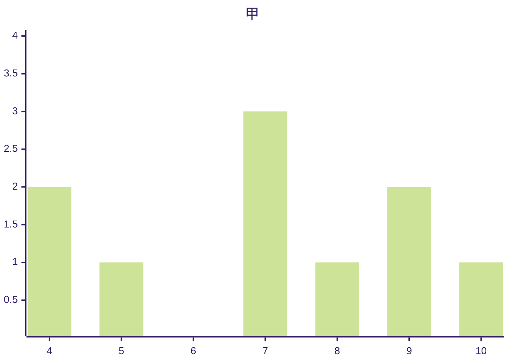
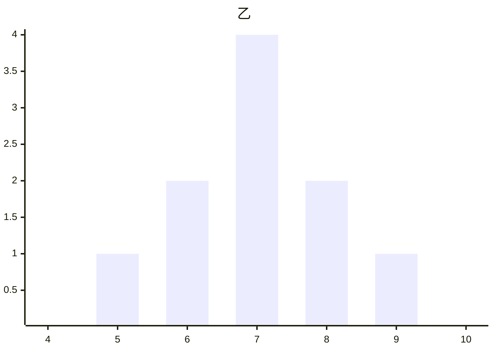

9.2.4 总体离散程度的估计

---

# 谁是更优秀的射击选手？

:::block{type="warning" title="问题描述"}

两位射击运动员在一次测试中各射靶 10 次，成绩如下：

  * **甲**： [4, 4, 5, 7, 7, 7, 8, 9, 9, 10]
  * **乙**： [5, 6, 6, 7, 7, 7, 7, 8, 8, 9]

如果这是一次选拔性考核，作为教练，你应该如何作出选择？

:::

:::block{type="info" title="初步考虑"}
回忆之前学习的知识，可以想到计算甲、乙两人成绩的**平均数**、**中位数**或**众数**来进行比较。
:::

:::block{type="example" title="！！？？"}
经过计算发现，甲乙两人成绩无论是平均数、中位数还是众数都是 $7$，怎么办？
:::

---

<Columns :columns="2">

<template #col2>

</template>

</Columns>

:::block{type="info" title="做出选择"}
由上图可以看出，甲的成绩较分散，乙的成绩相对集中，因此我们应该选择乙。
:::

:::block{type="example" title="我们需要什么？"}
我们需要用**数字**来衡量数据"离散/集中"的程度，这就是**离散程度的度量**。
:::

---

# 最简单的度量方法：极差

:::block{type="info" title="极差的定义"}
极差即为数据中最大值与最小值的差。
:::

:::block{type="success" title="实践一下"}
甲的极差： $10 - 4 = 6$

乙的极差： $9 - 5 = 4$

由此我们认为，乙比甲更好。
:::

:::block{type="danger" title="极差的局限性"}
仅使用了最大值和最小值，丢失了大量中间数据的信息，容易受极端值的影响。
:::

---

# 好一点的方法：平均距离

:::block{type="warning" title="为什么是平均距离？"}
如果射击成绩很稳定，大多数成绩偏离平均成绩不会太远。

因此，可以用数据与平均成绩的"平均距离"来度量波动幅度。
:::

:::block{type="info" title="如何定义平均距离？"}
假设数据为 $x_1, x_2, \dots, x_n$，平均数为 $\bar{x}$。用差的绝对值作为距离：
$$\frac{1}{n}\sum_{i=1}^{n}|x_i - \bar{x}|$$
:::

---

:::block{type="example" title="为什么用“平均距离”刻画离散程度，而不是“总距离”？"}
总距离会受样本容量 $n$ 的影响，不同样本量之间无法直接比较。
:::

:::block{type="danger" title="平均距离的缺点"}
含有绝对值的式子不便于代数运算。

例如，在知道两组数据的平均值和平均距离的前提下，无法合并得到整体的平均距离。
:::

---

# 超级好的方法：方差

:::block{type="info" title="方差的定义"}
改用平方来代替绝对值，得到这组数据的**方差**

$$s^2 = \frac{1}{n}\sum_{i=1}^{n}(x_i - \bar{x})^2$$

这是方差的定义，也称为方差的第一公式。
:::

:::block{type="default" title="符号说明"}
总体方差记为 $S^2$，样本方差记为 $s^2$。（为什么要加 ^2 ？待会就知道了）
:::

---

# 方差的另一种形式

:::block{type="info" title="另一种形式"}
课本上提到，方差的另一种形式是：

$$s^2 = \frac{1}{n}\sum_{i=1}^{n}x_i^2 - \bar{x}^2$$

也被称为方差的第二公式。
:::

:::block{type="example" title="！？"}
等等！这个括号就这么直接拆掉了…？
:::

:::block{type="warning" title="！！"}
事实上这是代数上完全正确的！让我们推导一下。
:::

---

# 为什么能这样化简？

$$
\begin{align*}
s^2 &= \frac{1}{n}\sum_{i=1}^{n}(x_i - \bar{x})^2
\\&= \frac{1}{n}\sum_{i=1}^{n}(x_i^2 - 2x_i\bar{x} + \bar{x}^2)
\\&= \frac{1}{n}\sum_{i=1}^{n}x_i^2 - \frac{2\bar{x}}{n}\sum_{i=1}^{n}x_i + \frac{1}{n}\sum_{i=1}^{n}\bar{x}^2
\\&= \frac{1}{n}\sum_{i=1}^{n}x_i^2 - \frac{2\bar{x}}{n} \cdot n\bar{x} + \frac{1}{n} \cdot n\bar{x}^2
\\&= \frac{1}{n}\sum_{i=1}^{n}x_i^2 - 2\bar{x}^2 + \bar{x}^2
\\&= \frac{1}{n}\sum_{i=1}^{n}x_i^2 - \bar{x}^2
\end{align*}
$$

---

# 标准差

:::block{type="warning" title="方差的量纲问题"}
方差的单位是原始数据单位的平方，与原始数据的量纲不一致。这在实际应用中不太方便。
:::

:::block{type="info" title="标准差的定义"}
为了解决这个问题，对方差开平方得到**标准差**：

$$s = \sqrt{\frac{1}{n}\sum_{i=1}^{n}(x_i - \bar{x})^2}$$

这样标准差的单位即与原始数据相同。

这解释了为什么方差的符号是 $s^2$，字面上即有 $s=\sqrt{s^2}$。

:::

:::block{type="default" title="符号说明"}
总体标准差记为 $S$，样本标准差记为 $s$。
:::

---

:::block{type="success" title="回到最初的问题…"}
现在我们可以用标准差来解决最初的问题：

- 甲的标准差：$s_甲 = 2$
- 乙的标准差：$s_乙 \approx 1.095$

结论：$s_甲 > s_乙$，说明甲的离散程度大，乙的成绩更稳定。因此应该选择乙作为运动员。
:::

:::block{type="default" title="我思考"}
标准差的取值范围是什么？标准差为 0 的一组数据有什么特点？
:::

:::block{type="info" title="解析"}
标准差的取值范围是 $s \geq 0$。

若 $s = 0$，说明所有数据点完全相同，且都等于平均数。
:::

---

# 线性变换对方差与标准差的影响

:::block{type="warning" title="考虑一个问题…"}
如果对所有数据进行线性变换 $x' = kx + b$，方差和标准差会如何变化？
:::

:::block{type="info" title="公式"}
设原数据为 $x_1, x_2, \dots, x_n$，平均数为 $\bar{x}$，方差为 $s^2$。

若令 $x_i' = kx_i + b$，则新数据的平均数为 $\bar{x}' = k\bar{x} + b$。

新数据的方差为：$s'^2 = k^2 s^2$，标准差变换为： $s' = |k| s$。

推导 ~~留作作业~~ 略。

:::

:::block{type="success" title="感性理解"}
整体平移不影响方差/标准差。

整体缩放方差乘以 $k^2$，标准差乘以 $|k|$

符合直觉：平移所有数据不改变数据的离散程度，放大所有数据会等比放大其离散程度。
:::

---

# 计算器使用的注意事项

:::block{type="warning" title="小心你的计算器！"}
使用计算器求方差时需要特别注意：

- 有的计算器采用**样本方差公式**：$s^2 = \displaystyle\frac{1}{n-1}\sum(x_i - \bar{x})^2$（也即无偏估计）
- 而教科书通常使用**总体方差公式**：$s^2 = \displaystyle\frac{1}{n}\sum(x_i - \bar{x})^2$

如果计算器用了错误的公式，需要乘以 $\displaystyle\frac{n-1}{n}$ 进行调整。

:::

>但是你问为什么？谜底稍后揭晓…

---

# 分层抽样中的方差计算

:::block{type="info" title="！？合并？！"}
在改进平均距离时我们提到，平均距离的一个缺点就是不能简单合并两组数据。例如在分层抽样时合并多层的数据。

但方差却可以，这是怎么做到的？我们一起来看看 213 页的例 6。
:::

:::block{type="warning" title="已知信息"}
男生：样本量 $n_1 = 23$，平均身高 $\bar{x} = 170.6$ cm，方差 $s_1^2 = 12.59$。

女生：样本量 $n_2 = 27$，平均身高 $\bar{y} = 160.6$ cm，方差 $s_2^2 = 38.62$。

目标：计算总体方差 $s^2$。
:::

---

:::block{type="warning" title="已知信息"}
男生：样本量 $n_1 = 23$，平均身高 $\bar{x} = 170.6$ cm，方差 $s_1^2 = 12.59$。

女生：样本量 $n_2 = 27$，平均身高 $\bar{y} = 160.6$ cm，方差 $s_2^2 = 38.62$。
:::

:::block{type="info" title="初步化简"}

根据方差定义，总体方差需要用所有数据与**总体平均数 $\bar{z}$** 计算：

$$s^2 = \frac{1}{50} \left[ \sum_{i=1}^{23}(x_i - \bar{z})^2 + \sum_{j=1}^{27}(y_j - \bar{z})^2 \right]$$

但我们还不知道任何一个 $x_i$！为了将未知的 $x_i$ 与 $\bar{z}$ 联系起来，我们在每项中减去并加上该层平均数：

$$s^2 = \frac{1}{50} \left[ \sum_{i=1}^{23}(x_i - \bar{x} + \bar{x} - \bar{z})^2 + \sum_{j=1}^{27}(y_j - \bar{y} + \bar{y} - \bar{z})^2 \right]$$

然后完全平方公式展开。以男生部分为例：

$$\sum_{i=1}^{23}(x_i - \bar{x} + \bar{x} - \bar{z})^2 = \sum_{i=1}^{23}(x_i - \bar{x})^2 + \sum_{i=1}^{23}2(x_i - \bar{x})(\bar{x} - \bar{z}) + \sum_{i=1}^{23}(\bar{x} - \bar{z})^2$$

:::

---

:::block{type="warning" title="已知信息"}
男生：样本量 $n_1 = 23$，平均身高 $\bar{x} = 170.6$ cm，方差 $s_1^2 = 12.59$。

女生：样本量 $n_2 = 27$，平均身高 $\bar{y} = 160.6$ cm，方差 $s_2^2 = 38.62$。
:::

:::block{type="info" title="继续化简…"}

$$\sum_{i=1}^{23}(x_i - \bar{x} + \bar{x} - \bar{z})^2 = \sum_{i=1}^{23}(x_i - \bar{x})^2 + \sum_{i=1}^{23}2(x_i - \bar{x})(\bar{x} - \bar{z}) + \sum_{i=1}^{23}(\bar{x} - \bar{z})^2$$

利用离差和为零：$\sum_{i=1}^{23}(x_i - \bar{x}) = 0$：

$$\sum_{i=1}^{23} 2(x_i - \bar{x})(\bar{x} - \bar{z}) = 2(\bar{x} - \bar{z}) \sum_{i=1}^{23} (x_i - \bar{x}) = 0$$

那么
$$\sum_{i=1}^{23}(x_i - \bar{x} + \bar{x} - \bar{z})^2 = \sum_{i=1}^{23}(x_i - \bar{x})^2 + \sum_{i=1}^{23}(\bar{x} - \bar{z})^2 = 23[ s_1^2+(\bar{x}-\bar{z})^2]$$

女生部分同理，即有

$$s^2 = \frac{1}{50} \left\{ 23[s_1^2 + (\bar{x} - \bar{z})^2] + 27[s_2^2 + (\bar{y} - \bar{z})^2] \right\}$$

与书上给出的结果相同。

:::

---

# 方差合并公式

:::block{type="info" title="公式"}
$$
\bar{x} = \frac1N{\sum_{i=1}^{k} n_i \bar{x}_i}
$$

$$s_{\text{total}}^2 = \frac1{N}\left({\sum_{i=1}^{k} n_i s_i^2} + \sum_{i=1}^{k} n_i (\bar{x}_i - \bar{x})^2\right)$$
:::

---

:::block{type="info" title="P214 案例：居民用水数据"}

100 户居民月均用水量统计：
- 平均数：$\bar{x} = 8.79$ 吨，标准差：$s \approx 6.20$ 吨

观察数据分布：
- 区间 $[\bar{x}-s,\ \bar{x}+s] = [2.59,\ 14.99]$：包含 **68 户**（68%）
- 区间 $[\bar{x}-2s,\ \bar{x}+2s] = [-3.61,\ 21.19]$：包含 **93 户**（93%，接近 95.45%）

也就是说，绝大部分数据落在 $[\bar x-2s,\bar x+2s]$ 内。

:::

:::block{type="info" title="冷知识！？"}

对于正态分布 $N(\bar x, s^2)$，无论 $\bar x$ 及 $s^2$ 的取值，总有以下规律：

- 区间 $[\bar x - s,\, \bar x + s]$ 包含约 **68.27%** 的数据
- 区间 $[\bar x - 2s,\, \bar x + 2s]$ 包含约 **95.45%** 的数据
- 区间 $[\bar x - 3s,\, \bar x + 3s]$ 包含约 **99.73%** 的数据
:::

---

:::block{type="success" title="彩蛋！"}

## 为什么样本方差要除以 $n-1$？

还记得我们在第 13 页留下的问题吗？

为什么计算器用 $n-1$，教科书有时用 $n$？

这背后实际上隐藏着统计学中的一个重要概念：无偏估计

:::

:::block{type="info" title="定义"}
如果用一个样本的统计量估计总体的一个参数，这个统计量的**期望值**正好等于被估计的真实参数，那么这个统计量就是**无偏估计**。
:::

:::block{type="example" title="为什么直接除 n 的到的会偏？"}

想象你是一位弓箭手，你射出了很多箭，他们的平均值位于靶心。

然后你取了个样本希望估计整体的方差。

而当试图直接用样本计算整体的方差时，选用的样本的平均值并不是靶心，而可能偏离靶心。

这意味着用样本的平均值得出的方差并不等同于使用整体的平均值计算得出的方差。
:::

---

:::block{type="warning" title="问题的根源"}
最"自然"的样本方差定义是：

$$S_n^2 = \frac{1}{n}\sum_{i=1}^{n}(x_i - \bar{x})^2$$

但数学上可以证明，这个公式**系统性地低估了总体方差**。

$$E[S_n^2] = \frac{n-1}{n}\sigma^2 \neq \sigma^2$$

估计值平均比真值小了 $\frac{1}{n}$ 倍。这就是**有偏的**。
:::

:::block{type="info" title="为什么会低估？"}
因为计算离差时用的是**样本均值 $\bar{x}$**，而不是真实的总体均值 $\mu$。

样本均值是使离差平方和**最小化**的那个点。所以数据点围绕样本均值的"散布"自然比围绕总体均值的"散布"要小。

这种"吸引力"的作用，使得离差平方和被人为地压小了，导致对总体方差的估计偏低。
:::

---

# 解决方案：贝塞尔修正

:::block{type="success" title="简单修正"}
为了消除这个系统性偏差，只需把分母从 $n$ 改成 $n-1$：

$$S^2 = \frac{1}{n-1}\sum_{i=1}^{n}(x_i - \bar{x})^2$$

乘以修正因子 $\displaystyle\frac{n}{n-1}$，就能抵消低估的影响。
:::

:::block{type="success" title="无偏性成立"}
可以数学上证明：

$$E[S^2] = \sigma^2$$

现在样本方差的期望**正好等于**总体方差。这被称为**贝塞尔修正**。
:::

---

# 数学证明

:::block{type="info" title="欲证"}
$$E[S^2] = E\left[\frac{1}{n-1}\sum_{i=1}^{n}(x_i - \bar{x})^2\right] = \sigma^2$$

其中 $\bar{x} = \frac{1}{n}\sum x_i$，$\sigma^2 = \operatorname{Var}(X)$ 是总体方差。
:::

---

:::block{type="warning" title="方差分解"}
将样本方差平方和分解为两部分：

$$\sum_{i=1}^{n}(x_i - \bar{x})^2 = \sum_{i=1}^{n}(x_i - \mu)^2 - n(\bar{x} - \mu)^2$$

这个恒等式建立了**样本方差**和**总体方差**之间的关系。
:::

:::block{type="info" title="推导过程"}

$$\begin{aligned}
\sum_{i=1}^{n}(x_i - \bar{x})^2 
&= \sum_{i=1}^{n}\big[(x_i - \mu) - (\bar{x} - \mu)\big]^2 \\
&= \sum_{i=1}^{n}(x_i - \mu)^2 - 2(\bar{x}-\mu)\sum_{i=1}^{n}(x_i-\mu) + n(\bar{x}-\mu)^2
\end{aligned}$$

注意 $\sum_{i=1}^{n}(x_i-\mu) = n(\bar{x}-\mu)$，所以：

$$= \sum_{i=1}^{n}(x_i - \mu)^2 - 2n(\bar{x}-\mu)^2 + n(\bar{x}-\mu)^2 = \sum_{i=1}^{n}(x_i - \mu)^2 - n(\bar{x}-\mu)^2$$

:::

---

:::block{type="warning" title="两边取期望"}
$$E\left[\sum_{i=1}^{n}(x_i - \bar{x})^2\right] = E\left[\sum_{i=1}^{n}(x_i - \mu)^2\right] - n \cdot E\left[(\bar{x} - \mu)^2\right]$$
:::

:::block{type="info" title="第一项"}

每个 $x_i$ 与总体 $X$ 同分布，所以：
$$E[(x_i - \mu)^2] = \sigma^2$$

因此：
$$E\left[\sum_{i=1}^{n}(x_i - \mu)^2\right] = n\sigma^2$$
:::

:::block{type="info" title="第二项"}

样本均值 $\bar{x}$ 的方差为 $\operatorname{Var}(\bar{x}) = \frac{\sigma^2}{n}$，且 $E[\bar{x}] = \mu$，所以：
$$E[(\bar{x} - \mu)^2] = \operatorname{Var}(\bar{x}) = \frac{\sigma^2}{n}$$

因此：
$$n \cdot E[(\bar{x} - \mu)^2] = n \cdot \frac{\sigma^2}{n} = \sigma^2$$
:::

---

## 第三步：得出结论

:::block{type="success" title="结合上述两项"}
$$E\left[\sum_{i=1}^{n}(x_i - \bar{x})^2\right] = n\sigma^2 - \sigma^2 = (n-1)\sigma^2$$

因此：
$$E[S^2] = E\left[\frac{1}{n-1}\sum_{i=1}^{n}(x_i - \bar{x})^2\right] = \frac{1}{n-1}(n-1)\sigma^2 = \sigma^2$$

由此即可证 $S^2$ 是总体方差 $\sigma^2$ 的无偏估计。
:::

---
layout: end
---

谢谢喵。